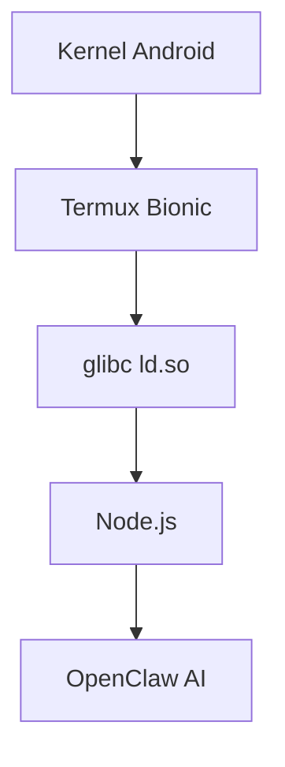
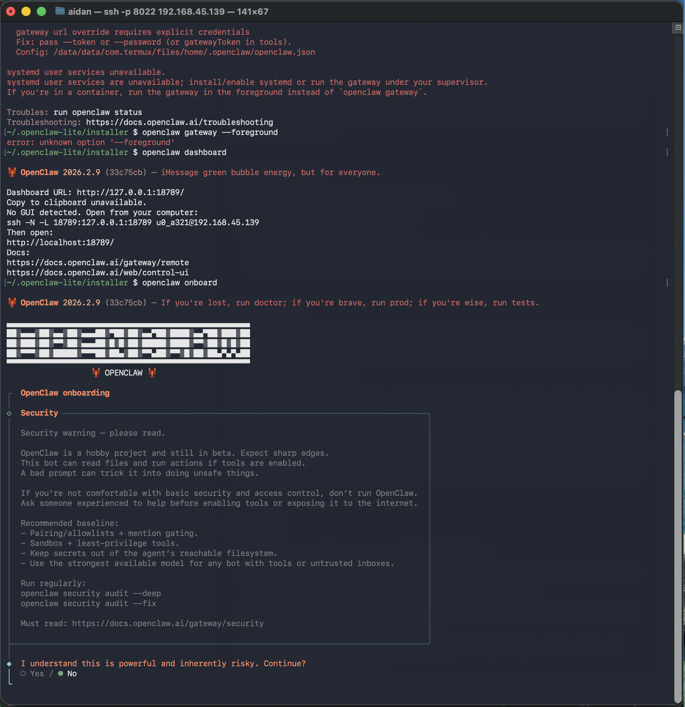
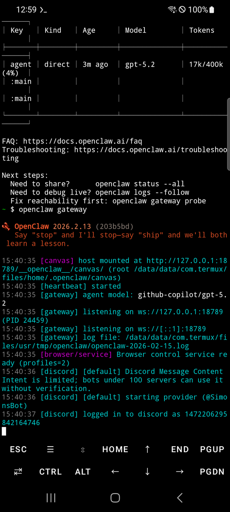

[](https://developer.android.com)
[](https://f-droid.org/packages/com.termux/)
[](https://proot-me.github.io/)
[](https://github.com/AidanPark/openclaw-android/blob/main/LICENSE)
[](https://github.com/AidanPark/openclaw-android)

<div align="center">


**🌟 OpenClaw en Android: Shell AI Nativo (200MB sin Distro Linux)**

[](https://github.com/AidanPark/openclaw-android/releases/latest)
[](https://f-droid.org/packages/com.termux/)

</div>

## Sin Instalación Linux Requerida

Enfoque estándar: proot-distro + Linux (1GB). **OpenClaw Android**: Solo glibc ld.so.

| | Estándar | **Este Proyecto** |
|---|----------|-------------------|
| Almacenamiento | 1-2GB | **~200MB** |
| Tiempo Setup | 20-30min | **3-10min** |
| Rendimiento | Lento (proot) | **Nativo** |



## App Claw Standalone

APK único (sin Termux):
- Setup con un toque.
- Dashboard integrado.

[Descargar APK](https://github.com/AidanPark/openclaw-android/releases)

## Requisitos

- Android **7.0+** (10+ recomendado)
- **1GB** libre
- Wi-Fi

## Setup Paso a Paso

<details><summary>📱 APK (Más Fácil)</summary>

1. [APK Releases](https://github.com/AidanPark/openclaw-android/releases)
2. Instala.
3. Abre app → Setup automático.

</details>

<details><summary>💻 Termux</summary>

```bash
pkg update -y && pkg install -y curl
curl -sL myopenclawhub.com/install | bash && source ~/.bashrc
openclaw onboard
openclaw gateway  # Nueva pestaña
```

</details>




## Comandos CLI

| Comando | Acción |
|---------|--------|
| `oa --update` | Actualizar |
| `oa --status` | Estado |
| `oa --backup` | Backup |
| `openclaw gateway` | AI Live |

## 🔒 Seguridad

**✅ Seguro**: Sin root. Sandbox Android.

Permisos: INTERNET, WAKE_LOCK (estándar).

## Troubleshooting

<details><summary>¿Gateway con PID bloqueado?</summary>

```bash
rm -rf $PREFIX/tmp/openclaw-*
pkill openclaw
```

</details>

[Guía Completa](docs/troubleshooting.md)

## Idiomas

| EN | **ES** | KO | ZH |
|----|--------|----|----|
| [README.in.md](README.in.md) | README.es.md | [KO](README.ko.md) | [ZH](README.zh.md) |

<div align="center">
⭐ <b>¡Estrella el repo!</b><br>
<a href="https://github.com/AidanPark/openclaw-android/releases">Releases</a> | <a href="https://github.com/AidanPark/openclaw-android/issues">Issues</a>
</div>
