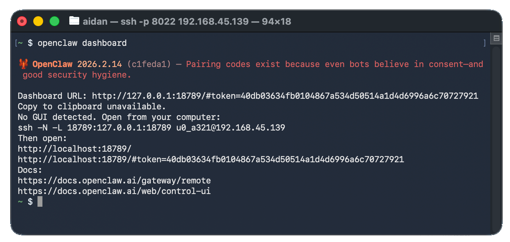
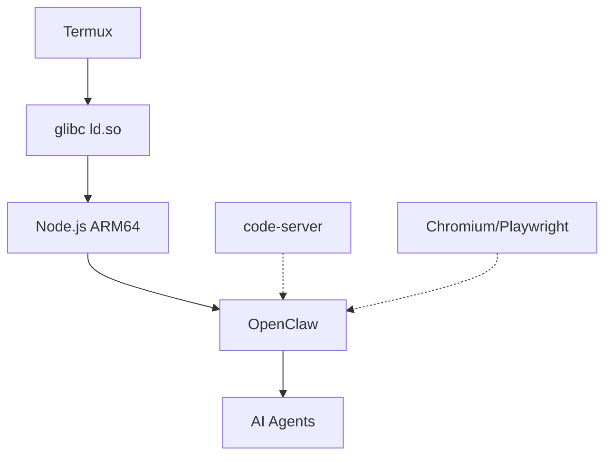

# OpenClaw on Android 🦞

[](https://developer.android.com)
[](https://f-droid.org/packages/com.termux/)
[](https://github.com/termux/proot-distro)
[](https://github.com/AidanPark/openclaw-android/blob/main/LICENSE)
[](https://github.com/AidanPark/openclaw-android)
[](https://github.com/AidanPark/openclaw-android/releases)
[](https://github.com/AidanPark/openclaw-android/network)
[](https://github.com/AidanPark/openclaw-android/issues)

## 📖 Table of Contents

- [🌟 Features](#features)
- [🚀 Quick Start](#quick-start)
- [📱 Claw App](#claw-app)
- [📋 Step-by-Step Setup](#step-by-step-setup)
- [⚙️ CLI Reference](#cli-reference)
- [🔄 Update & Backup](#update--backup)
- [🛠️ Technical Details](#technical-details)
- [❓ Troubleshooting](#troubleshooting)
- [📊 Performance](#performance)
- [🤖 Local LLM](#local-llm-on-android)
- [📚 License](#license)

[Español](README.md) | [한국어](README.ko.md) | [中文](README.zh.md)

<div align="center">
  
  <br><br>
  <a href="#quick-start"></a>
  <a href="https://github.com/AidanPark/openclaw-android/releases"></a>
  <a href="https://github.com/AidanPark/openclaw-android/stargazers"></a>
</div>

> [!NOTE]
> **Ready in 5 minutes** • **200MB storage** • **No Linux distro needed**

Because Android deserves a shell.

## 🌟 Features

<div align="center">
<table>
<tr>
<td width="25%">
  <details><summary>🚀 <b>Lightning Setup</b></summary>
  
  One command installs glibc + Node.js + OpenClaw. <b>3-10 min</b> on WiFi.
  </details>
</td>
<td width="25%">
  <details><summary>📱 <b>Standalone App</b></summary>
  
  APK with WebView dashboard + PTY terminal. No Termux needed.
  </details>
</td>
<td width="25%">
  <details><summary>⚡ <b>Native Speed</b></summary>
  
  Just glibc ld.so — <b>no proot overhead</b>. Same performance as PC.
  </details>
</td>
<td width="25%">
  <details><summary>🛠️ <b>Full Toolchain</b></summary>
  code-server, Playwright, AI CLIs. Update with <code>oa --update</code>.
  </details>
</td>
</tr>
</table>
</div>

## No Linux Installation Required

The standard approach to running OpenClaw on Android requires installing proot-distro with Linux, adding 700MB-1GB of overhead. OpenClaw on Android eliminates this by installing only the glibc dynamic linker (ld.so), letting you run OpenClaw without a full Linux distribution.

**Standard approach**: Install a full Linux distro in Termux via proot-distro.

```
┌───────────────────────────────────────────────────┐
│ Linux Kernel                                      │
│ ┌───────────────────────────────────────────────┐ │
│ │ Android · Bionic libc · Termux                │ │
│ │ ┌───────────────────────────────────────────┐ │ │
│ │ │ proot-distro · Debian/Ubuntu              │ │ │
│ │ │ ┌───────────────────────────────────────┐ │ │ │
│ │ │ │ GNU glibc                             │ │ │ │
│ │ │ │ Node.js → OpenClaw                    │ │ │ │
│ │ │ └───────────────────────────────────────┘ │ │ │
│ │ └───────────────────────────────────────────┘ │ │
│ └───────────────────────────────────────────────┘ │
└───────────────────────────────────────────────────┘
```

**This project**: No proot-distro — just the glibc dynamic linker.

```
┌───────────────────────────────────────────────────┐
│ Linux Kernel                                      │
│ ┌───────────────────────────────────────────────┐ │
│ │ Android · Bionic libc · Termux                │ │
│ │ ┌───────────────────────────────────────────┐ │ │
│ │ │ glibc ld.so (linker only)                 │ │ │
│ │ │ ld.so → Node.js → OpenClaw                │ │ │
│ │ └───────────────────────────────────────────┘ │ │
│ └───────────────────────────────────────────────┘ │
└───────────────────────────────────────────────────┘
```

| | Standard (proot-distro) | OpenClaw Android |
|---|---|---|
| 💾 Storage | 1-2GB (Linux + packages) | **~200MB** |
| ⏱️ Setup | 20-30 min | **3-10 min** |
| ⚡ Performance | Slower (proot layer) | **Native speed** |
| 🔧 Steps | Multi-step distro setup | **One command** |

## Claw App

A standalone Android app is also available. It bundles a terminal emulator and WebView-based UI into a single APK — no Termux required.

- One-tap setup: bootstrap, Node.js and OpenClaw installed from the app
- Built-in dashboard for gateway control, runtime info and tool management
- Works independently of Termux — installing the app doesn't affect an existing Termux + `oa` setup

Download the APK from the [Releases](https://github.com/AidanPark/openclaw-android/releases) page.

## 🚀 Quick Start

> [!IMPORTANT]
> **Install from F-Droid** — Play Store Termux is discontinued.

1. [ ] Install [Termux from F-Droid](https://f-droid.org/packages/com.termux/)
2. [ ] Run: `pkg update -y && pkg install -y curl`
3. [ ] `curl -sL myopenclawhub.com/install | bash`
4. [ ] `openclaw onboard`
5. [ ] New tab: `openclaw gateway`
6. [ ] Open dashboard: [myopenclawhub.com](https://myopenclawhub.com)

## 📋 Step-by-Step Setup

### Requirements

- Android 7.0 or higher (Android 10+ recommended)
- ~1GB free storage
- Wi-Fi or mobile data connection

### What the Installer Does

The installer automatically resolves differences between Termux and standard Linux:

1. **glibc environment** — Installs the glibc dynamic linker (via pacman's glibc-runner)
2. **Node.js (glibc)** — Downloads official Node.js linux-arm64 and wraps it with an ld.so loader script
3. **Path conversion** — Automatically converts standard Linux paths to Termux paths
4. **Temp folder setup** — Configures an Android-accessible temp folder
5. **Service manager bypass** — Configures normal operation without systemd
6. **OpenCode integration** — If selected, installs OpenCode using proot + ld.so concatenation

### Step 1: Prepare Your Phone 📱

> [!TIP]
> Enable **Developer Options** → **Stay Awake** + disable battery optimization.

See the [Keep Processes Alive guide](docs/disable-phantom-process-killer.md) for step-by-step instructions.

### Step 2: Install Termux

> **Important**: Play Store Termux is discontinued and won't work. Install from F-Droid.

1. Open your browser and go to [f-droid.org](https://f-droid.org)
2. Search `Termux` → tap **Download APK**

### Step 3: Initial Termux Setup

```bash
pkg update -y && pkg install -y curl
```

### Step 4: Install OpenClaw ⚡

> [!TIP]
> **SSH Tip**: Use the [Termux SSH Guide](docs/termux-ssh-guide.md) to type from a physical keyboard.

```bash
curl -sL myopenclawhub.com/install | bash && source ~/.bashrc
```

Everything installs automatically. Takes 3–10 minutes. Wi-Fi recommended.

### Step 5: Initial Setup

```bash
openclaw onboard
```


### Step 6: Start the Gateway

> **Important**: Run `openclaw gateway` directly in Termux on your phone, not via SSH.

Open a new tab (☰ icon → **NEW SESSION**) and run:

```bash
openclaw gateway
```


> To stop: `Ctrl+C`. Don't use `Ctrl+Z` — it only suspends the process.

## Keep Processes Alive

Android may kill background processes. See the [Keep Processes Alive guide](docs/disable-phantom-process-killer.md) for all recommended settings.

## Access Dashboard from Your PC

See the [Termux SSH Setup Guide](docs/termux-ssh-guide.md).

## Manage Multiple Devices

Use the <a href="https://myopenclawhub.com" target="_blank">Dashboard Connect</a> tool to manage multiple devices from your PC.

- Save connection settings (IP, token, ports) with a nickname
- Auto-generates SSH tunnel command and dashboard URL
- **Your data stays local** — saved only in browser localStorage

## ⚙️ CLI Reference

```bash
oa --help
```

| Command | Description |
|---------|-------------|
| `oa --update` | 🔄 Update everything |
| `oa --install` | 🛠️ Add tools |
| `oa --uninstall` | 🗑️ Remove everything |
| `oa --backup` | 💾 Backup data |
| `oa --restore` | ⬆️ Restore |
| `oa --status` | 📊 Status |
| `oa --version` | 📝 Version |

## 🔄 Update & Backup

### Update

```bash
oa --update && source ~/.bashrc
```

Updates at once: OpenClaw, code-server, OpenCode, AI CLIs and Android patches. Already-updated components are skipped. Safe to run multiple times.

> If `oa` is unavailable: `curl -sL myopenclawhub.com/update | bash && source ~/.bashrc`

### Backup

```bash
oa --backup
```

Backups stored in `~/.openclaw-android/backup/` with timestamp. Includes config, state, workspaces and agents.

### Restore

```bash
oa --restore
```

Lists available backups and restores the selected one to `~/.openclaw/`.

## ❓ Troubleshooting

See the [Troubleshooting Guide](docs/troubleshooting.md) for detailed solutions.

## 📊 Performance

CLI commands may feel slower than on PC due to phone storage speed. However, **once the gateway is running, there's no difference** — the process stays in memory and AI responses are processed on external servers.

## 🤖 Local LLM on Android

OpenClaw supports local LLM inference via [node-llama-cpp](https://github.com/withcatai/node-llama-cpp). The prebuilt binary (`@node-llama-cpp/linux-arm64`) loads successfully under glibc — **technically functional on the phone**.

| Constraint | Details |
|------------|---------|
| RAM | GGUF models need 2-4GB free (7B, Q4). RAM shared with Android |
| Storage | Models from 4GB to 70GB+. Limited space |
| Speed | CPU-only on ARM is very slow. No GPU offloading |
| Use case | For production, use cloud LLM APIs (same speed as PC) |

For experimentation: TinyLlama 1.1B (Q4, ~670MB) runs on the phone.

> **Why `--ignore-scripts`?** node-llama-cpp's postinstall tries to compile llama.cpp from source via cmake — 30+ minutes on phone and fails due to toolchain incompatibilities. Prebuilt binaries work without this step.

<details>
<summary>🛠️ Technical Details</summary>



## Installed Components

### Core Infrastructure

| Component | Role | Installation |
|-----------|------|-------------|
| git | Version control | `pkg install` |

### Runtime Dependencies (L2)

| Component | Role | Installation |
|-----------|------|-------------|
| [pacman](https://wiki.archlinux.org/title/Pacman) | glibc package manager | `pkg install` |
| [glibc-runner](https://github.com/termux-pacman/glibc-packages) | glibc dynamic linker | `pacman -Sy` |
| [Node.js](https://nodejs.org/) v22 LTS (linux-arm64) | JavaScript runtime | nodejs.org |
| python, make, cmake, clang, binutils | Native build tools | `pkg install` |

### OpenClaw Platform

| Component | Role | Installation |
|-----------|------|-------------|
| [OpenClaw](https://github.com/openclaw/openclaw) | AI agent platform | `npm install -g` |
| [clawdhub](https://github.com/AidanPark/clawdhub) | Skills manager | `npm install -g` |
| [PyYAML](https://pyyaml.org/) | YAML parser for `.skill` | `pip install` |

### Optional Tools

| Component | Role | Installation |
|-----------|------|-------------|
| [tmux](https://github.com/tmux/tmux) | Terminal multiplexer | `pkg install` |
| [ttyd](https://github.com/tsl0922/ttyd) | Web terminal | `pkg install` |
| [dufs](https://github.com/sigoden/dufs) | HTTP/WebDAV server | `pkg install` |
| [android-tools](https://developer.android.com/tools/adb) | ADB | `pkg install` |
| [code-server](https://github.com/coder/code-server) | Browser VS Code | GitHub |
| [OpenCode](https://opencode.ai/) | AI coding assistant (TUI) | `bun install -g` |
| [Chromium](https://www.chromium.org/) | Browser automation (~400MB) | Custom script |
| [Playwright](https://playwright.dev/) | Browser automation library | Custom script |
| [Claude Code](https://github.com/anthropics/claude-code) | Anthropic AI CLI | `npm install -g` |
| [Gemini CLI](https://github.com/google-gemini/gemini-cli) | Google AI CLI | `npm install -g` |
| [Codex CLI](https://github.com/DioNanos/codex-termux) | AI CLI (Termux fork) | `npm install -g` |

## Project Structure

```
openclaw-android/
├── bootstrap.sh                # One-liner curl | bash installer
├── install.sh                  # Main installer (entry point)
├── oa.sh                       # Unified CLI ($PREFIX/bin/oa)
├── post-setup.sh               # Post-bootstrap Claw App (OTA)
├── update.sh                   # Wrapper → update-core.sh
├── update-core.sh              # Lightweight updater
├── uninstall.sh                # Clean removal
├── patches/
│   ├── glibc-compat.js         # Node.js runtime patches
│   ├── argon2-stub.js          # argon2 stub (code-server)
│   ├── termux-compat.h         # C header for Bionic builds
│   ├── spawn.h                 # POSIX spawn stub
│   └── systemctl               # systemd stub
├── scripts/
│   ├── lib.sh                  # Shared functions library
│   ├── check-env.sh            # Pre-flight check
│   ├── install-infra-deps.sh   # L1 infrastructure
│   ├── install-glibc.sh        # glibc-runner (L2)
│   ├── install-nodejs.sh       # Node.js glibc wrapper (L2)
│   ├── install-build-tools.sh  # Build tools (L2)
│   ├── backup.sh               # Backup/restore
│   ├── install-chromium.sh     # Chromium
│   ├── install-playwright.sh   # Playwright
│   ├── install-code-server.sh  # code-server
│   ├── install-opencode.sh     # OpenCode
│   ├── setup-env.sh            # Environment variables
│   └── setup-paths.sh          # Directories and symlinks
├── platforms/
│   └── openclaw/
│       ├── config.env          # Metadata and dependencies
│       ├── env.sh              # Platform env vars
│       ├── install.sh          # Platform install
│       ├── update.sh           # Platform update
│       ├── uninstall.sh        # Platform removal
│       ├── status.sh           # Platform status
│       ├── verify.sh           # Platform verification
│       └── patches/            # Platform-specific patches
├── tests/
│   └── verify-install.sh       # Post-install verification
└── docs/
    ├── disable-phantom-process-killer.md
    ├── termux-ssh-guide.md
    ├── troubleshooting.md
    └── images/
```

## Architecture

```
┌─────────────────────────────────────────────────────────────┐
│  Orchestrators (install.sh, update-core.sh, uninstall.sh)  │
│  ── Platform-agnostic. Reads config.env and delegates.     │
├─────────────────────────────────────────────────────────────┤
│  Shared Scripts (scripts/)                                  │
│  ── L1: install-infra-deps.sh (always)                     │
│  ── L2: install-glibc.sh, install-nodejs.sh,               │
│         install-build-tools.sh (conditional config.env)    │
│  ── L3: Optional tools (user-selected)                     │
├─────────────────────────────────────────────────────────────┤
│  Platform Plugins (platforms/<name>/)                       │
│  ── config.env: declares dependencies (PLATFORM_NEEDS_*)   │
│  ── install.sh / update.sh / uninstall.sh / ...            │
└─────────────────────────────────────────────────────────────┘
```

| Layer | Scope | Examples | Controlled by |
|-------|-------|----------|---------------|
| L1 | Infrastructure (always) | git, `pkg update` | Orchestrator |
| L2 | Platform runtime (conditional) | glibc, Node.js, build tools | `config.env` flags |
| L3 | Optional tools | tmux, code-server, AI CLIs | User prompts |

## Installation Flow — 8 Steps

### [1/8] Environment Check

- Termux detection, CPU architecture, disk space (min 1000MB)
- Existing install detection, Node.js version, Phantom Process Killer notice

### [2/8] Platform Selection

Loads platform `config.env`. Currently fixed to `openclaw`.

### [3/8] Optional Tools Selection

11 individual Y/n prompts: tmux, ttyd, dufs, android-tools, Chromium, Playwright, code-server, OpenCode, Claude Code, Gemini CLI, Codex CLI.

### [4/8] Core Infrastructure (L1)

`pkg update && pkg upgrade`, installs `git`, creates base directories.

### [5/8] Runtime Dependencies (L2)

| Flag | Script | Installs |
|------|--------|---------|
| `PLATFORM_NEEDS_GLIBC=true` | `install-glibc.sh` | pacman, glibc-runner |
| `PLATFORM_NEEDS_NODEJS=true` | `install-nodejs.sh` | Node.js v22 LTS + wrappers |
| `PLATFORM_NEEDS_BUILD_TOOLS=true` | `install-build-tools.sh` | python, make, cmake, clang |

### [6/8] Platform Install (L2)

`npm install -g openclaw@latest --ignore-scripts`, patches, clawdhub, `openclaw update`.

### [7/8] Optional Tools (L3)

Installs tools selected in step 3.

### [8/8] Verification

| Check | Level | Condition |
|-------|-------|-----------|
| Node.js >= 22 | FAIL | `node -v` >= 22 |
| npm | FAIL | command exists |
| OA_GLIBC=1 | FAIL | variable set |
| glibc-compat.js | FAIL | file exists |
| glibc ld.so | FAIL | `ld-linux-aarch64.so.1` exists |
| node wrapper | FAIL | `~/.openclaw-android/bin/node` |
| code-server | WARN | `code-server --version` |
| openclaw | PLATFORM | `openclaw --version` |

## Update Flow — `oa --update`

5 steps: pre-flight check → download tarball → update infrastructure → update platform → update installed optional tools.

</details>

## 🎉 Join the Community

<div align="center">
  <a href="https://github.com/AidanPark/openclaw-android/stargazers"><b>⭐ Star us</b></a> |
  <a href="https://github.com/AidanPark/openclaw-android/issues"><b>🐛 Issues</b></a> |
  <a href="https://github.com/AidanPark/openclaw-android/discussions"><b>💬 Discussions</b></a>
</div>

## 📚 License

MIT License. See [LICENSE](LICENSE) for details.
