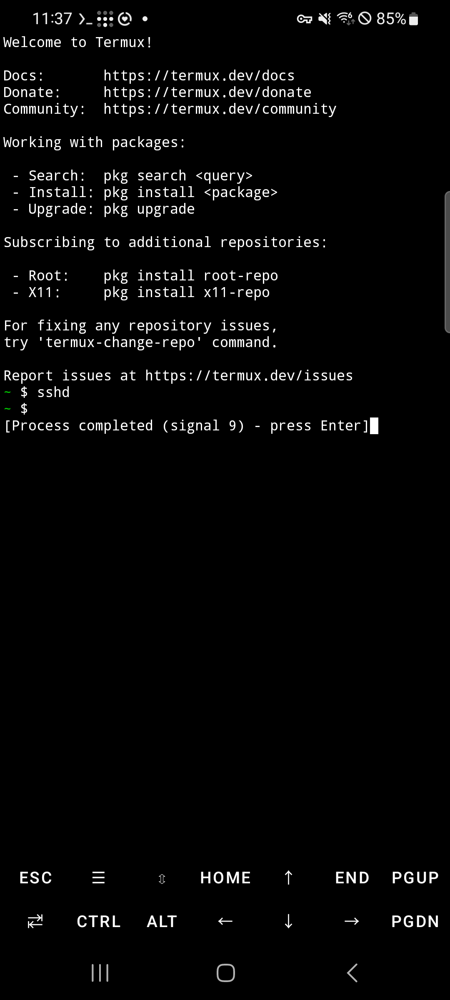
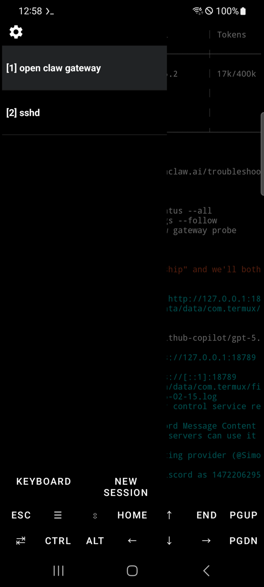
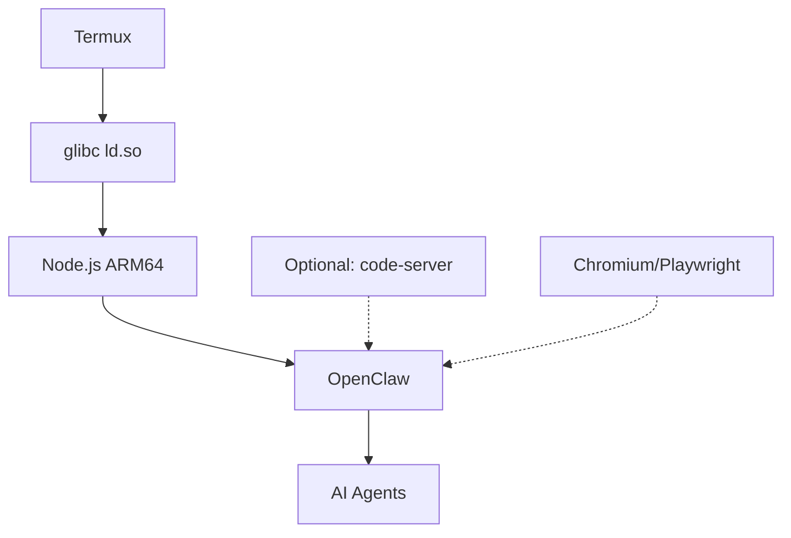

# OpenClaw en Android 🦞

[](https://developer.android.com)
[](https://f-droid.org/packages/com.termux/)
[](https://github.com/termux/proot-distro)
[](/blob/main/LICENSE)
[](https://github.com/AidanPark/openclaw-android)
[](https://github.com/AidanPark/openclaw-android/releases)
[](https://github.com/AidanPark/openclaw-android/network)
[](https://github.com/AidanPark/openclaw-android/issues)

## 📖 Tabla de Contenidos

- [🌟 Características](#features)
- [🚀 Inicio Rápido](#quick-start)
- [📱 App Claw](#claw-app)
- [📋 Configuración Paso a Paso](#step-by-step-setup)
- [⚙️ Referencia CLI](#cli-reference)
- [🔄 Actualización y Respaldo](#update--backup)
- [🛠️ Detalles Técnicos](#technical-details)
- [❓ Solución de Problemas](#troubleshooting)
- [📊 Rendimiento](#performance)
- [🤖 LLM Local](#local-llm)
- [📚 Licencia](#license)

[한국어](README.ko.md) | [中文](README.zh.md) | [Español](README.md)

<div align="center">
  
  <br><br>
  <a href="#quick-start"></a>
  <a href="https://github.com/AidanPark/openclaw-android/releases"></a>
  <a href="https://github.com/AidanPark/openclaw-android/stargazers"></a>
</div>

> [!NOTE]  
> **Listo en 5 minutos** • **200MB de almacenamiento** • **Sin distro Linux necesaria**

Porque Android merece un shell.

## 🌟 Características

<div align="center">
<table>
<tr>
<td width="25%">
  <details><summary>🚀 <b>Configuración Relámpago</b></summary>
  
  Un comando instala glibc + Node.js + OpenClaw. **3-10 min** en WiFi.
  </details>
</td>
<td width="25%">
  <details><summary>📱 <b>App Independiente</b></summary>
  
  APK con dashboard WebView + terminal PTY. No Termux necesario.
  </details>
</td>
<td width="25%">
  <details><summary>⚡ <b>Velocidad Nativa</b></summary>
  
  Solo glibc ld.so — **sin sobrecarga proot**. Mismo rendimiento que PC.
  </details>
</td>
<td width="25%">
  <details><summary>🛠️ <b>Cadena de Herramientas Completa</b></summary>
  code-server, Playwright, CLIs IA. Actualizar con `oa --update`.
  </details>
</td>
</tr>
</table>
</div>

## Sin instalación de Linux requerida

El enfoque estándar para ejecutar OpenClaw en Android requiere instalar proot-distro con Linux, añadiendo 700MB-1GB de sobrecarga. OpenClaw en Android elimina esto instalando solo el enlazador dinámico glibc (ld.so), permitiéndote ejecutar OpenClaw sin una distribución Linux completa.

**Enfoque estándar**: Instalar una distribución Linux completa en Termux vía proot-distro.

```
┌───────────────────────────────────────────────────┐
│ Linux Kernel                                      │
│ ┌───────────────────────────────────────────────┐ │
│ │ Android · Bionic libc · Termux                │ │
│ │ ┌───────────────────────────────────────────┐ │ │
│ │ │ proot-distro · Debian/Ubuntu              │ │ │
│ │ │ ┌───────────────────────────────────────┐ │ │ │
│ │ │ │ GNU glibc                             │ │ │ │
│ │ │ │ Node.js → OpenClaw                    │ │ │ │
│ │ │ └───────────────────────────────────────┘ │ │ │
│ │ └───────────────────────────────────────────┘ │ │
│ └───────────────────────────────────────────────┘ │
└───────────────────────────────────────────────────┘
```

**Este proyecto**: Sin proot-distro — solo el enlazador dinámico glibc.

```
┌───────────────────────────────────────────────────┐
│ Linux Kernel                                      │
│ ┌───────────────────────────────────────────────┐ │
│ │ Android · Bionic libc · Termux                │ │
│ │ ┌───────────────────────────────────────────┐ │ │
│ │ │ glibc ld.so (solo enlazador)              │ │ │
│ │ │ ld.so → Node.js → OpenClaw                │ │ │
│ │ └───────────────────────────────────────────┘ │ │
│ └───────────────────────────────────────────────┘ │
└───────────────────────────────────────────────────┘
```

| | Estándar (proot-distro) | OpenClaw Android |
|---|---|---|
| 💾 Almacenamiento | 1-2GB (Linux + paquetes) | **~200MB** |
| ⏱️ Configuración | 20-30 min | **3-10 min** |
| ⚡ Rendimiento | Más lento (capa proot) | **Velocidad nativa** |
| 🔧 Pasos | Configuración multi-paso de distro | **Un comando** |

##  App Claw

También está disponible una app Android independiente. Agrupa un emulador de terminal y una UI basada en WebView en un solo APK — no requiere Termux.

- Configuración con un toque: bootstrap, Node.js y OpenClaw instalados desde la app
- Dashboard integrado para control de gateway, info de runtime y gestión de herramientas
- Funciona independientemente de Termux — instalar la app no afecta una configuración existente de Termux + `oa`

Descarga el APK desde la página de [Releases](https://github.com/AidanPark/openclaw-android/releases).

## 🚀 Inicio Rápido {#quick-start}

> [!IMPORTANT]  
> **Instalar desde F-Droid** — Termux de Play Store está descontinuado.

1. [ ] Instalar [Termux desde F-Droid](https://f-droid.org/packages/com.termux/)
2. [ ] Ejecutar: `pkg update -y && pkg install curl`
3. [ ] `curl -sL myopenclawhub.com/install | bash`
4. [ ] `openclaw onboard`
5. [ ] Nueva pestaña: `openclaw gateway`
6. [ ] Abrir dashboard: [myopenclawhub.com](https://myopenclawhub.com)

<details>
<summary>🎥 Video Demo</summary>
<iframe width="800" height="450" src="https://www.youtube.com/embed/dQw4w4w9WgXc" frameborder="0" allowfullscreen></iframe>
<!-- Replace with actual demo video -->
</details>

## 📋 Configuración Paso a Paso {#step-by-step-setup}

## Requisitos

- Android 7.0 o superior (Android 10+ recomendado)
- ~1GB de almacenamiento libre
- Conexión Wi-Fi o datos móviles

## Qué Hace

El instalador resuelve automáticamente las diferencias entre Termux y Linux estándar. No necesitas hacer nada manual — el único comando de instalación maneja todo esto:

1. **Entorno glibc** — Instala el enlazador dinámico glibc (vía glibc-runner de pacman) para que los binarios Linux estándar se ejecuten sin modificación
2. **Node.js (glibc)** — Descarga Node.js linux-arm64 oficial y lo envuelve con un script loader ld.so (sin patchelf, que causa segfault en Android)
3. **Conversión de rutas** — Convierte automáticamente rutas Linux estándar (`/tmp`, `/bin/sh`, `/usr/bin/env`) a rutas Termux
4. **Configuración de carpeta temporal** — Configura una carpeta temp accesible para Android
5. **Bypass de gestor de servicios** — Configura operación normal sin systemd
6. **Integración OpenCode** — Si se selecciona, instala OpenCode usando proot + concatenación ld.so para binarios Bun standalone

## Configuración Paso a Paso (desde un teléfono nuevo)

1. [Preparar tu Teléfono](#step-1-prepare-your-phone)
2. [Instalar Termux](#step-2-install-termux)
3. [Configuración Inicial de Termux](#step-3-initial-termux-setup)
4. [Instalar OpenClaw](#step-4-install-openclaw) — un comando
5. [Iniciar Configuración de OpenClaw](#step-5-start-openclaw-setup)
6. [Iniciar OpenClaw (Gateway)](#step-6-start-openclaw-gateway)

### Paso 1: Preparar tu Teléfono 📱

> [!TIP]  
> Activar **Opciones de desarrollador** → **Mantener despierto** + deshabilitar optimización de batería.

Configura Opciones de Desarrollador, Mantener Despierto, límite de carga y optimización de batería. Ver la [guía Mantener Procesos Vivos](docs/disable-phantom-process-killer.md) para instrucciones paso a paso.



### Paso 2: Instalar Termux

> **Importante**: La versión de Termux en Play Store está descontinuada y no funcionará. Debes instalar desde F-Droid.

1. Abre el navegador de tu teléfono y ve a [f-droid.org](https://f-droid.org)
2. Busca `Termux`, luego toca **Descargar APK** para descargar e instalar
   - Permite "Instalar desde fuentes desconocidas" cuando se solicite

### Paso 3: Configuración Inicial de Termux

Abre la app Termux y pega el siguiente comando para instalar curl (necesario para el siguiente paso).

```bash
pkg update -y && pkg install -y curl
```

> Puede pedirse elegir un mirror en la primera ejecución. Elige cualquiera — un mirror geográficamente más cercano será más rápido.

### Paso 4: Instalar OpenClaw ⚡

> [!TIP]  
> **Tip SSH**: Usa [Guía SSH Termux](docs/termux-ssh-guide.md) para tecleo con teclado.

<div dir="ltr">

| Terminal | Salida Esperada |
|----------|-----------------|
| ```bash<br>curl -sL myopenclawhub.com/install \| bash && source ~/.bashrc<br>``` | ![Success]<br>```<br>[OpenClaw installed]<br>openclaw onboard<br>``` |

</div>

Todo se instala automáticamente con un solo comando. Toma 3–10 minutos dependiendo de la velocidad de red y dispositivo. Wi-Fi recomendado.

Una vez completo, se muestra la versión de OpenClaw junto con instrucciones para ejecutar `openclaw onboard`.

### Paso 5: Iniciar Configuración de OpenClaw

Como se indica en la salida de instalación, ejecuta:

```bash
openclaw onboard
```

Sigue las instrucciones en pantalla para completar la configuración inicial.


### Paso 6: Iniciar OpenClaw (Gateway)

Una vez completada la configuración, inicia el gateway:

> **Importante**: Ejecuta `openclaw gateway` directamente en la app Termux en tu teléfono, no vía SSH. Si lo ejecutas sobre SSH, el gateway se detendrá cuando la sesión SSH se desconecte.

El gateway ocupa la terminal mientras se ejecuta, así que abre una nueva pestaña para él. Toca el **icono hamburguesa (☰)** en la barra de menú inferior, o desliza hacia la derecha desde el borde izquierdo de la pantalla (sobre la barra de menú inferior) para abrir el menú lateral. Luego toca **NEW SESSION**.



En la nueva pestaña, ejecuta:

```bash
openclaw gateway
```


> Para detener el gateway, presiona `Ctrl+C`. No uses `Ctrl+Z` — solo suspende el proceso sin terminarlo.

## Mantener Procesos Vivos

Android puede matar procesos en segundo plano o limitarlos cuando la pantalla está apagada. Ver la [guía Mantener Procesos Vivos](docs/disable-phantom-process-killer.md) para todas las configuraciones recomendadas (Opciones de Desarrollador, Mantener Despierto, límite de carga, optimización de batería y Phantom Process Killer).

## Acceder al Dashboard desde tu PC

Ver la [Guía de Configuración SSH Termux](docs/termux-ssh-guide.md) para acceso SSH y configuración de túnel dashboard.

## Gestionar Múltiples Dispositivos

Si ejecutas OpenClaw en múltiples dispositivos en la misma red, usa la herramienta <a href="https://myopenclawhub.com" target="_blank">Dashboard Connect</a> para gestionarlos desde tu PC.

- Guarda configuraciones de conexión (IP, token, puertos) para cada dispositivo con un apodo
- Genera el comando túnel SSH y URL dashboard automáticamente
- **Tus datos permanecen locales** — Las configuraciones de conexión (IP, token, puertos) se guardan solo en localStorage del navegador y nunca se envían a ningún servidor.

## ⚙️ Referencia CLI {#cli-reference}

```bash
oa --help
```

| Comando | Descripción | Ejemplo |
|---------|-------------|---------|
| `oa --update` | 🔄 Actualizar todo | `oa --update` |
| `oa --install` | 🛠️ Añadir herramientas | `oa --install` |
| `oa --uninstall` | 🗑️ Remover todo | `oa --uninstall` |
| `oa --backup` | 💾 Respaldo de datos | `oa --backup` |
| `oa --restore` | ⬆️ Restaurar | `oa --restore` |
| `oa --status` | 📊 Estado | `oa --status` |
| `oa --version` | 📝 Versión | `oa --version` |

## Actualización

```bash
oa --update && source ~/.bashrc
```

Este único comando actualiza todos los componentes instalados de una vez:

- **OpenClaw** — Paquete principal (`openclaw@latest`)
- **code-server** — IDE de navegador
- **OpenCode** — Asistente de codificación IA
- **Herramientas CLI IA** — Claude Code, Gemini CLI, Codex CLI (Termux)
- **Parches Android** — Parches de compatibilidad de este proyecto

Los componentes ya actualizados se saltan. Los componentes no instalados no se tocan — solo se actualiza lo que ya está en tu dispositivo. Seguro ejecutar múltiples veces.

> Si el comando `oa` no está disponible (instalaciones antiguas), ejecútalo con curl:
> ```bash
> curl -sL myopenclawhub.com/update | bash && source ~/.bashrc
> ```

## Respaldo y Restauración

El comando de respaldo integrado de OpenClaw (`openclaw backup create`) a menudo falla en Android porque depende de hardlinks, bloqueados en el almacenamiento privado de apps de Android. El comando `oa --backup` lo soluciona usando `tar` directamente manteniendo compatibilidad completa con la especificación de respaldo de OpenClaw.

Para crear un respaldo:
```bash
oa --backup
```
Los respaldos se almacenan en `~/.openclaw-android/backup/` con nombre con timestamp (ej. `2026-03-14T00-00-00.000Z-openclaw-backup.tar.gz`). También puedes especificar una ruta personalizada: `oa --backup ~/my-backups/`. Cada respaldo incluye tu configuración, estado, workspaces y agents.

Para restaurar desde un respaldo:
```bash
oa --restore
```
Este comando lista todos los respaldos disponibles en el directorio de respaldo predeterminado. Simplemente selecciona el número del respaldo a restaurar. La herramienta detecta automáticamente la plataforma del manifiesto del respaldo y maneja la restauración a `~/.openclaw/`. Nota que sobrescribirá datos existentes, por lo que se requiere confirmación.

## ❓ Solución de Problemas {#troubleshooting}

Ver la [Guía de Solución de Problemas](docs/troubleshooting.md) para soluciones detalladas.

## 📊 Rendimiento {#performance}

Comandos CLI como `openclaw status` pueden sentirse más lentos que en PC. Esto es porque cada comando necesita leer muchos archivos, y el almacenamiento del teléfono es más lento que el de un PC, con procesamiento de seguridad de Android añadiendo sobrecarga.

Sin embargo, **una vez que el gateway está ejecutándose, no hay diferencia**. El proceso permanece en memoria por lo que los archivos no necesitan releerse, y las respuestas IA se procesan en servidores externos — misma velocidad que en PC.

## 🤖 LLM Local en Android {#local-llm}

OpenClaw soporta inferencia LLM local vía [node-llama-cpp](https://github.com/withcatai/node-llama-cpp). El binario nativo precompilado (`@node-llama-cpp/linux-arm64`) se incluye con la instalación y carga exitosamente bajo el entorno glibc — **LLM local es técnicamente funcional en el teléfono**.

Sin embargo, hay restricciones prácticas:

| Restricción | Detalles |
|-------------|----------|
| RAM | Modelos GGUF necesitan al menos 2-4GB de memoria libre (modelo 7B, Q4). RAM del teléfono se comparte con Android y otras apps |
| Almacenamiento | Archivos de modelo de 4GB a 70GB+. Almacenamiento del teléfono se llena rápido |
| Velocidad | Inferencia CPU-only en ARM es muy lenta. Android no soporta offloading GPU para llama.cpp |
| Caso de uso | OpenClaw ruta principalmente a APIs LLM cloud (OpenAI, Gemini, etc.) a misma velocidad que PC. Inferencia local es suplementaria |

For experimentation, small models like TinyLlama 1.1B (Q4, ~670MB) can run on the phone. For production use, cloud LLM providers are recommended.

> **¿Por qué `--ignore-scripts`?** El instalador usa `npm install -g openclaw@latest --ignore-scripts` porque el script postinstall de node-llama-cpp intenta compilar llama.cpp desde fuente vía cmake — un proceso que toma 30+ minutos en teléfono y falla por incompatibilidades de toolchain. Los binarios precompilados funcionan sin este paso de compilación, así que el postinstall se salta de forma segura.

<details open>
<summary>🛠️ Detalles Técnicos {#technical-details}</summary>




## Componentes Instalados

El instalador configura infraestructura, paquetes de plataforma y herramientas opcionales a través de múltiples gestores de paquetes. La infraestructura principal y dependencias de plataforma se instalan automáticamente; las herramientas opcionales se preguntan individualmente durante la instalación.

### Infraestructura Principal

| Componente | Rol | Método de Instalación |
|------------|-----|-----------------------|
| git | Control de versiones, dependencias npm git | `pkg install` |

### Dependencias Runtime de Plataforma de Agentes

Estas están controladas por las banderas `config.env` de la plataforma. Para OpenClaw, todas se instalan:

| Componente | Rol | Método de Instalación |
|------------|-----|-----------------------|
| [pacman](https://wiki.archlinux.org/title/Pacman) | Gestor de paquetes para paquetes glibc | `pkg install` |
| [glibc-runner](https://github.com/termux-pacman/glibc-packages) | Enlazador dinámico glibc — habilita binarios Linux estándar en Android | `pacman -Sy` |
| [Node.js](https://nodejs.org/) v22 LTS (linux-arm64) | Runtime JavaScript para OpenClaw | Descarga directa de nodejs.org |
| python | Scripts de build para addons nativos C/C++ (node-gyp) | `pkg install` |
| make | Ejecución Makefile para módulos nativos | `pkg install` |
| cmake | Builds de módulos nativos basados en CMake | `pkg install` |
| clang | Compilador C/C++ para módulos nativos | `pkg install` |
| binutils | Utilidades binarias (llvm-ar) para builds nativos | `pkg install` |

### Plataforma OpenClaw

| Componente | Rol | Método de Instalación |
|------------|-----|-----------------------|
| [OpenClaw](https://github.com/openclaw/openclaw) | Plataforma de agentes IA (núcleo) | `npm install -g` |
| [clawdhub](https://github.com/AidanPark/clawdhub) | Gestor de skills para OpenClaw | `npm install -g` |
| [PyYAML](https://pyyaml.org/) | Parser YAML para empaquetado `.skill` | `pip install` |
| libvips | Headers para procesamiento de imágenes para build sharp | `pkg install` (en actualización) |

### Herramientas Opcionales (preguntadas durante instalación)

Cada herramienta se ofrece vía prompt Y/n individual. Eliges cuáles instalar.

| Componente | Rol | Método de Instalación |
|------------|-----|-----------------------|
| [tmux](https://github.com/tmux/tmux) | Multiplexor de terminal para sesiones en fondo | `pkg install` |
| [ttyd](https://github.com/tsl0922/ttyd) | Terminal web — acceso Termux desde navegador | `pkg install` |
| [dufs](https://github.com/sigoden/dufs) | Servidor HTTP/WebDAV para transferencia archivos vía navegador | `pkg install` |
| [android-tools](https://developer.android.com/tools/adb) | ADB para deshabilitar Phantom Process Killer | `pkg install` |
| [code-server](https://github.com/coder/code-server) | IDE VS Code basado en navegador | Descarga directa de GitHub |
| [OpenCode](https://opencode.ai/) | Asistente codificación IA (TUI). Auto-instala [Bun](https://bun.sh/) y [proot](https://proot-me.github.io/) como dependencias | `bun install -g` |
| [Chromium](https://www.chromium.org/) | Automatización navegador para OpenClaw (~400MB) | Script de instalación personalizado |
| [Playwright](https://playwright.dev/) | Librería automatización navegador (requiere Chromium). Auto-configura `PLAYWRIGHT_CHROMIUM_EXECUTABLE_PATH` | Script de instalación personalizado |
| [Claude Code](https://github.com/anthropics/claude-code) (Anthropic) | Herramienta CLI IA | `npm install -g` |
| [Gemini CLI](https://github.com/google-gemini/gemini-cli) (Google) | Herramienta CLI IA | `npm install -g` |
| [Codex CLI](https://github.com/DioNanos/codex-termux) (fork Termux de OpenAI Codex) | Herramienta CLI IA | `npm install -g` |

## Estructura del Proyecto

```
openclaw-android/
├── bootstrap.sh                # Instalador one-liner curl | bash (downloader)
├── install.sh                  # Instalador consciente de plataforma (punto de entrada)
├── oa.sh                       # CLI unificado (instalado como $PREFIX/bin/oa)
├── post-setup.sh               # Configuración post-bootstrap App Claw (entrega OTA)
├── update.sh                   # Wrapper delgado (descarga y ejecuta update-core.sh)
├── update-core.sh              # Actualizador ligero para instalaciones existentes
├── uninstall.sh                # Remoción limpia (orquestador)
├── patches/
│   ├── glibc-compat.js        # Parches runtime Node.js (os.cpus, networkInterfaces)
│   ├── argon2-stub.js          # Stub JS para módulo nativo argon2 (code-server)
│   ├── termux-compat.h         # Header C para builds nativos Bionic (sharp)
│   ├── spawn.h                 # Header stub POSIX spawn
│   ├── systemctl               # Stub systemd para Termux
│   ├── apply-patches.sh        # Orquestador parches legacy (compat v1.0.2)
│   └── patch-paths.sh          # Fijador rutas legacy (compat v1.0.2)
├── scripts/
│   ├── lib.sh                  # Librería funciones compartidas (colores, detección plataforma, prompts)
│   ├── check-env.sh            # Chequeo pre-vuelo entorno
│   ├── install-infra-deps.sh   # Paquetes infraestructura principal (L1)
│   ├── install-glibc.sh        # Instalación glibc-runner (L2 condicional)
│   ├── install-nodejs.sh       # Instalación wrapper glibc Node.js (L2 condicional)
│   ├── install-build-tools.sh  # Herramientas build para módulos nativos (L2 condicional)
│   ├── backup.sh               # Respaldo y restauración datos OpenClaw (oa --backup/--restore)
│   ├── build-sharp.sh          # Build módulo nativo sharp (procesamiento imágenes)
│   ├── install-chromium.sh     # Instalación Chromium para automatización navegador
│   ├── install-playwright.sh   # Instalación librería Playwright automatización navegador
│   ├── install-code-server.sh  # Instalación/actualización code-server (IDE navegador)
│   ├── install-opencode.sh     # Instalación OpenCode
│   ├── setup-env.sh            # Configurar variables entorno
│   └── setup-paths.sh          # Crear directorios y symlinks
├── platforms/
│   ├── openclaw/               # Plugin plataforma OpenClaw
│   │   ├── config.env          # Metadatos plataforma y declaraciones dependencias
│   │   ├── env.sh              # Variables entorno específicas de plataforma
│   │   ├── install.sh          # Instalación paquete plataforma (npm, parches, clawdhub)
│   │   ├── update.sh           # Actualización paquete plataforma
│   │   ├── uninstall.sh        # Remoción paquete plataforma
│   │   ├── status.sh           # Visualización estado plataforma
│   │   ├── verify.sh           # Chequeos verificación plataforma
│   │   └── patches/            # Parches específicos de plataforma
│   │       ├── openclaw-apply-patches.sh
│   │       ├── openclaw-patch-paths.sh
│   │       └── openclaw-build-sharp.sh
├── tests/
│   └── verify-install.sh       # Verificación post-instalación (orquestador + plataforma)
└── docs/
    ├── disable-phantom-process-killer.md    # Guía Mantener Procesos Vivos (EN)
    ├── disable-phantom-process-killer.ko.md # Guía Mantener Procesos Vivos (KO)
    ├── termux-ssh-guide.md     # Guía configuración SSH Termux (EN)
    ├── termux-ssh-guide.ko.md  # Guía configuración SSH Termux (KO)
    ├── troubleshooting.md      # Guía solución problemas (EN)
    ├── troubleshooting.ko.md   # Guía solución problemas (KO)
    └── images/                 # Capturas y imágenes
```

## Arquitectura

El proyecto usa una **arquitectura plugin-plataforma** que separa la infraestructura agnóstica de plataforma del código específico de plataforma:

```
┌─────────────────────────────────────────────────────────────┐
│  Orquestadores (install.sh, update-core.sh, uninstall.sh)  │
│  ── Agnóstica de plataforma. Lee config.env y delega.      │
├─────────────────────────────────────────────────────────────┤
│  Scripts Compartidos (scripts/)                             │
│  ── L1: install-infra-deps.sh (siempre)                    │
│  ── L2: install-glibc.sh, install-nodejs.sh,               │
│         install-build-tools.sh (condicional config.env)    │
│  ── L3: Herramientas opcionales (seleccionadas usuario)    │
├─────────────────────────────────────────────────────────────┤
│  Plugins Plataforma (platforms/<name>/)                     │
│  ── config.env: declara dependencias (PLATFORM_NEEDS_*)    │
│  ── install.sh / update.sh / uninstall.sh / ...            │
└─────────────────────────────────────────────────────────────┘
```

**Capas de dependencias:**

| Capa | Alcance | Ejemplos | Controlado por |
|------|---------|----------|----------------|
| L1 | Infraestructura (siempre instalada) | git, `pkg update` | Orquestador |
| L2 | Runtime plataforma (condicional) | glibc, Node.js, herramientas build | Banderas `config.env` |
| L3 | Herramientas opcionales (seleccionadas usuario) | tmux, code-server, CLIs IA | Prompts usuario |

Cada plataforma declara sus dependencias L2 en `config.env`:

```bash
# platforms/openclaw/config.env
PLATFORM_NEEDS_GLIBC=true
PLATFORM_NEEDS_NODEJS=true
PLATFORM_NEEDS_BUILD_TOOLS=true
```

El orquestador lee estas banderas y ejecuta condicionalmente los scripts de instalación correspondientes. Una plataforma que no necesita ciertas dependencias simplemente establece las banderas correspondientes a `false` y esas dependencias pesadas se saltan completamente.

## Flujo de Instalación Detallado

Ejecutar `bash install.sh` ejecuta los siguientes 8 pasos en orden.

### [1/8] Chequeo de Entorno — `scripts/check-env.sh`

Valida que el entorno actual es adecuado antes de iniciar la instalación.

- **Detección Termux**: Chequea la variable de entorno `$PREFIX`. Sale inmediatamente si no está en Termux
- **Chequeo arquitectura**: Ejecuta `uname -m` para verificar arquitectura CPU (aarch64 recomendado, armv7l soportado, x86_64 tratado como emulador)
- **Espacio disco**: Asegura al menos 1000MB libres en partición `$PREFIX`. Error si insuficiente
- **Instalación existente**: Si comando `openclaw` ya existe, muestra versión actual y nota que es reinstalación/upgrade
- **Pre-chequeo Node.js**: Si Node.js ya instalado, muestra versión y advierte si <22
- **Phantom Process Killer** (Android 12+): Muestra nota informativa sobre Phantom Process Killer con enlace a [guía deshabilitar](docs/disable-phantom-process-killer.md)

### [2/8] Selección de Plataforma

Selecciona la plataforma a instalar. Actualment codificado a `openclaw`. Versiones futuras presentarán UI de selección cuando múltiples plataformas disponibles.

Carga `config.env` de la plataforma vía `load_platform_config()` desde `scripts/lib.sh`, que exporta todas las variables `PLATFORM_*` para uso en pasos posteriores.

### [3/8] Selección Herramientas Opcionales (L3)

Presenta 11 prompts Y/n individuales (vía `/dev/tty`) para herramientas opcionales:

- tmux, ttyd, dufs, android-tools
- Chromium, Playwright
- code-server, OpenCode
- Claude Code, Gemini CLI, Codex CLI (Termux)

Todas las selecciones se recolectan al inicio antes de cualquier instalación. Permite al usuario tomar todas las decisiones de una vez y alejarse durante la instalación.

### [4/8] Infraestructura Principal (L1) — `scripts/install-infra-deps.sh` + `scripts/setup-paths.sh`

Se ejecuta siempre independientemente de la selección de plataforma.

**install-infra-deps.sh:**
- Ejecuta `pkg update -y && pkg upgrade -y` para refrescar y actualizar paquetes
- Instala `git` (requerido para dependencias npm git y clonación repo)

**setup-paths.sh:**
- Crea directorios `$PREFIX/tmp` y `$HOME/.openclaw-android/patches`
- Muestra mapeos de rutas Linux estándar (`/bin/sh`, `/usr/bin/env`, `/tmp`) a equivalentes Termux

### [5/8] Dependencias Runtime Plataforma (L2)

Instala condicionalmente dependencias runtime basadas en banderas `config.env` de la plataforma:

| Bandera | Script | Lo que instala |
|---------|--------|----------------|
| `PLATFORM_NEEDS_GLIBC=true` | `scripts/install-glibc.sh` | pacman, glibc-runner (proveé `ld-linux-aarch64.so.1`) |
| `PLATFORM_NEEDS_NODEJS=true` | `scripts/install-nodejs.sh` | Node.js v22 LTS linux-arm64, scripts wrapper estilo grun |
| `PLATFORM_NEEDS_BUILD_TOOLS=true` | `scripts/install-build-tools.sh` | python, make, cmake, clang, binutils |

Cada script es autocontenido con pre-chequeos y comportamiento idempotente (salta si ya instalado).

### [6/8] Platform Package Install (L2) — `platforms/<platform>/install.sh`

Delegates to the platform's own install script. For OpenClaw, this:

1. Sets `CPATH` for glib-2.0 headers (needed for native module builds)
2. Installs PyYAML via pip (for `.skill` packaging)
3. Copies `glibc-compat.js` to `~/.openclaw-android/patches/`
4. Installs `systemctl` stub to `$PREFIX/bin/`
5. Runs `npm install -g openclaw@latest --ignore-scripts`
6. Applies platform-specific patches via `openclaw-apply-patches.sh`
7. Installs `clawdhub` (skill manager) and `undici` dependency if needed
8. Runs `openclaw update` (includes building native modules like sharp)

**[6.5] Environment Variables + CLI + Marker:**

After platform install, the orchestrator:
- Runs `setup-env.sh` to write the `.bashrc` environment block
- Evaluates the platform's `env.sh` for platform-specific variables
- Writes the platform marker file (`~/.openclaw-android/.platform`)
- Installs `oa` CLI and `oaupdate` wrapper to `$PREFIX/bin/`
- Copies `lib.sh`, `setup-env.sh`, and the platform directory to `~/.openclaw-android/` for use by the updater and uninstaller

### [7/8] Install Optional Tools (L3)

Installs the tools selected in Step 3:

- **Termux packages**: tmux, ttyd, dufs, android-tools — installed via `pkg install`
- **code-server**: Browser-based VS Code IDE with Termux-specific workarounds (replace bundled node, patch argon2, handle hard link failures)
- **OpenCode**: AI coding assistant using proot + ld.so concatenation for Bun standalone binaries
- **Chromium**: Browser automation support for OpenClaw (~400MB)
- **Playwright**: Browser automation library (`playwright-core` via npm). Auto-sets `PLAYWRIGHT_CHROMIUM_EXECUTABLE_PATH` and `PLAYWRIGHT_SKIP_BROWSER_DOWNLOAD` environment variables. Installs Chromium automatically if not already present
- **AI CLI tools**: Claude Code, Gemini CLI, Codex CLI (Termux) — installed via `npm install -g`

### [8/8] Verification — `tests/verify-install.sh`

Runs a two-tier verification:

**Orchestrator checks (FAIL level):**

| Check Item | PASS Condition |
|------------|---------------|
| Node.js version | `node -v` >= 22 |
| npm | `npm` command exists |
| TMPDIR | Environment variable is set |
| OA_GLIBC | Set to `1` |
| glibc-compat.js | File exists in `~/.openclaw-android/patches/` |
| .glibc-arch | Marker file exists |
| glibc dynamic linker | `ld-linux-aarch64.so.1` exists |
| glibc node wrapper | Wrapper script at `~/.openclaw-android/bin/node` |
| Directories | `~/.openclaw-android`, `$PREFIX/tmp` exist |
| .bashrc | Contains environment variable block |

**Orchestrator checks (WARN level, non-critical):**

| Check Item | PASS Condition |
|------------|---------------|
| code-server | `code-server --version` succeeds |
| opencode | `opencode` command available |

**Platform verification** — delegates to `platforms/<platform>/verify.sh`:

| Check Item | PASS Condition |
|------------|---------------|
| openclaw | `openclaw --version` succeeds |
| CONTAINER | Set to `1` |
| clawdhub | Command available |
| ~/.openclaw | Directory exists |

All FAIL-level items pass → PASSED. Any FAIL → shows reinstall instructions. WARN items do not cause failure.

## Lightweight Updater Flow — `oa --update`

Running `oa --update` (or `oaupdate` for backward compatibility) downloads the latest release tarball from GitHub and executes the following 5 steps.

### [1/5] Pre-flight Check

Validates the minimum conditions for updating.

- Checks `$PREFIX` exists (Termux environment)
- Checks `curl` is available
- Detects platform from `~/.openclaw-android/.platform` marker file
- Detects architecture: glibc (`.glibc-arch` marker) or Bionic (legacy)
- Migrates old directory name if needed (`.openclaw-lite` → `.openclaw-android` — legacy compatibility)
- **Phantom Process Killer** (Android 12+): Shows an informational note with a link to the [disable guide](docs/disable-phantom-process-killer.md)

### [2/5] Download Latest Release

Downloads the full repository tarball from GitHub and extracts to a temp directory. Validates that all required files exist:

- `scripts/lib.sh`
- `scripts/setup-env.sh`
- `platforms/<platform>/config.env`
- `platforms/<platform>/update.sh`

### [3/5] Update Core Infrastructure

Updates shared files used by the updater, uninstaller, and CLI:

- Copies the latest platform directory to `~/.openclaw-android/platforms/`
- Updates `lib.sh` and `setup-env.sh` in `~/.openclaw-android/scripts/`
- Updates patch files (`glibc-compat.js`, `argon2-stub.js`, `spawn.h`, `systemctl`)
- Updates `oa` CLI and `oaupdate` wrapper in `$PREFIX/bin/`
- Updates `uninstall.sh` in `~/.openclaw-android/`
- If Bionic architecture detected, performs automatic glibc migration
- Runs `setup-env.sh` to refresh `.bashrc` environment block

### [4/5] Update Platform

Delegates to `platforms/<platform>/update.sh`. For OpenClaw, this:

- Installs build dependencies (`libvips`, `binutils`)
- Updates `openclaw` npm package to latest version
- Re-applies platform-specific patches
- Rebuilds sharp native module if openclaw was updated
- Updates/installs `clawdhub` (skill manager)
- Installs `undici` for clawdhub if needed (Node.js v24+)
- Migrates skills from `~/skills/` to `~/.openclaw/workspace/skills/` if needed
- Installs PyYAML if missing

### [5/5] Update Optional Tools

Updates tools that are already installed:

- **code-server**: Runs `install-code-server.sh` in update mode. Skipped if not installed
- **OpenCode**: Updates if installed; offers to install if not. Requires glibc architecture
- **Chromium**: Updates if installed. Skipped if not installed
- **AI CLI tools** (Claude Code, Gemini CLI, Codex CLI (Termux)): Compares installed vs latest npm version, updates if needed. Tools not installed are not offered for installation

</details>

## ❓ Troubleshooting {#troubleshooting}

See [Troubleshooting Guide](docs/troubleshooting.md).

## 📊 Performance {#performance}

CLI slower due to storage I/O. **Gateway runs at full PC speed**.

## 🤖 Local LLM {#local-llm}

Local inference works (node-llama-cpp), but cloud APIs recommended for speed.

## 🎉 Join the Community

<div align="center">
  <a href="https://github.com/AidanPark/openclaw-android/stargazers">
    <b>⭐ Star us</b> • Help others find this project!
  </a> | 
  <a href="https://github.com/AidanPark/openclaw-android/issues">
    <b>🐛 Issues</b>
  </a> | 
  <a href="https://github.com/AidanPark/openclaw-android/discussions">
    <b>💬 Discussions</b>
  </a>
</div>

## 📚 License {#license}

MIT License. See [LICENSE](/LICENSE) for details.

[](https://github.com/AidanPark/openclaw-android/stargazers)
[](https://github.com/AidanPark/openclaw-android/network/members)
