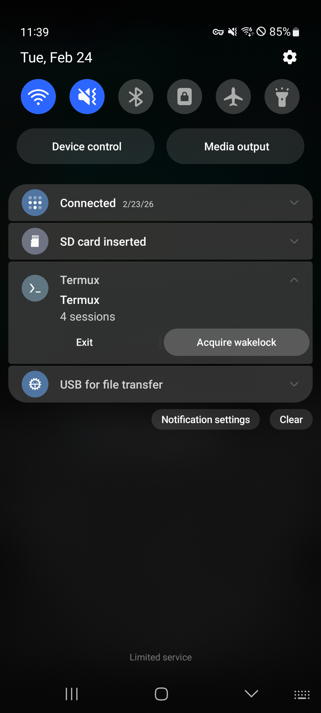
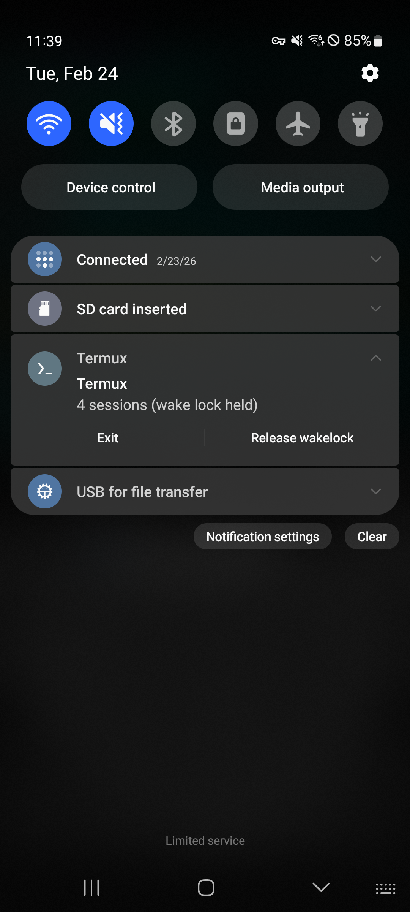
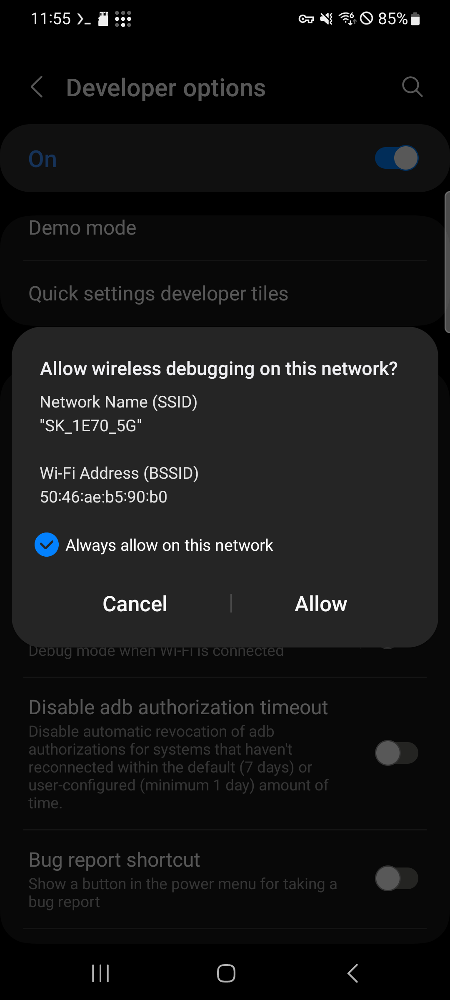
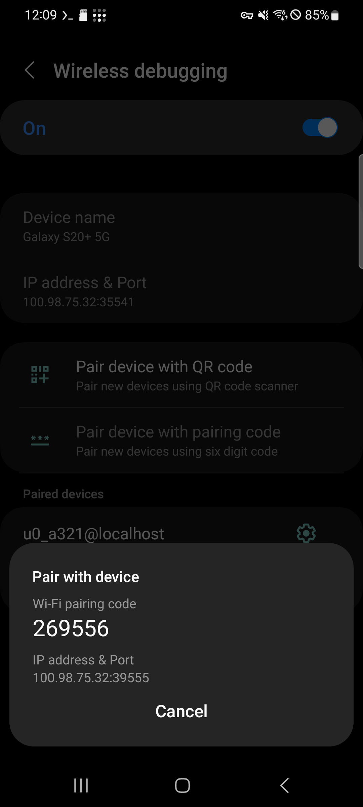
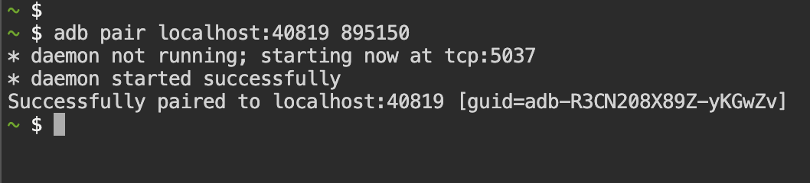
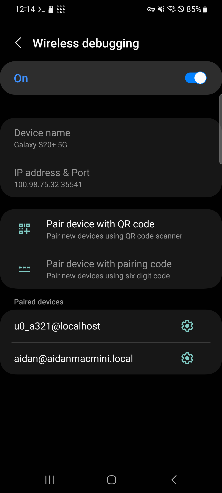
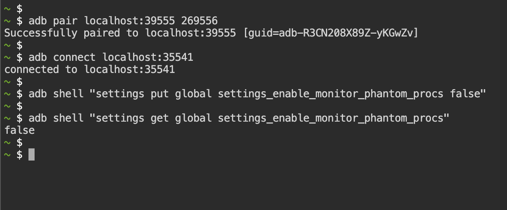

# Mantener procesos vivos en Android

OpenClaw corre como servidor, así que la gestión de energía y los mecanismos de kill de procesos de Android pueden interferir con su operación estable. Esta guía cubre todas las opciones necesarias para que los procesos sigan corriendo.

---

## Índice

- [Activar opciones de desarrollador](#activar-opciones-de-desarrollador)
- [Mantener encendido al cargar](#mantener-encendido-al-cargar)
- [Limitar carga máxima](#limitar-carga-máxima)
- [Desactivar optimización de batería para Termux](#desactivar-optimización-de-batería-para-termux)
- [Desactivar Phantom Process Killer (Android 12+)](#desactivar-phantom-process-killer-android-12)
- [Notas](#notas)
- [Lecturas recomendadas](#lecturas-recomendadas)

---

## Activar opciones de desarrollador

1. Ve a **Ajustes → Acerca del teléfono** (o **Información del dispositivo**).
2. Toca **Número de compilación** **7 veces**.
3. Aparecerá "Modo desarrollador activado".
4. Introduce el patrón/PIN si se solicita.

> En algunos dispositivos, **Número de compilación** está en **Ajustes → Acerca del teléfono → Información de software**.

---

## Mantener encendido al cargar

1. Ve a **Ajustes → Opciones de desarrollador** (el menú que acabas de activar).
2. Activa **No apagar pantalla**.
3. La pantalla quedará encendida mientras el teléfono esté cargando (USB o inalámbrico).

> La pantalla se apagará normalmente cuando lo desconectes. Mantén el cargador conectado al correr el servidor por períodos largos.

---

## Limitar carga máxima

Mantener un teléfono conectado 24/7 al 100 % puede hinchar la batería. Limitar la carga al **80 %** mejora notablemente la vida útil y la seguridad.

- **Samsung**: **Ajustes → Batería → Protección de batería** → seleccionar **Máximo 80 %**.
- **Google Pixel**: **Ajustes → Batería → Protección de batería** → ON.

> Los nombres del menú varían por fabricante. Busca "protección de batería" o "límite de carga" en los ajustes. Si tu dispositivo no tiene esta opción, gestiona el cargador manualmente o usa un enchufe inteligente.

---

## Desactivar optimización de batería para Termux

1. **Ajustes → Batería** (o **Batería y cuidado del dispositivo**).
2. Abre **Optimización de batería** (o **Gestión de energía de apps**).
3. Encuentra **Termux** y ponlo en **No optimizado** (o **Sin restricciones**).

> La ruta exacta varía por fabricante (Samsung, LG, Xiaomi, etc.) y versión de Android. Busca "optimización de batería" en los ajustes.

---

## Desactivar Phantom Process Killer (Android 12+)

Android 12+ incluye **Phantom Process Killer**, una función que mata automáticamente procesos en segundo plano. Puede terminar procesos de Termux como `openclaw gateway`, `sshd` o `ttyd` sin aviso.

### Síntomas

Si ves este mensaje en Termux, Android forzó el cierre del proceso:

```
[Process completed (signal 9) - press Enter]
```


`Signal 9` (SIGKILL) no puede ser capturado ni bloqueado por ningún proceso — Android lo mató a nivel del kernel.

### Requisitos

- **Android 12 o superior** (Android 11 e inferiores no se ven afectados).
- **Termux** con `android-tools` instalado (incluido en OpenClaw on Android).

### Paso 1 — Adquirir wake lock

Desliza la barra de notificaciones y encuentra la notificación de Termux. Toca **Acquire wakelock** para evitar que Android suspenda Termux.

<p>
  
  
</p>

Una vez activado, la notificación mostrará **"wake lock held"** y el botón cambia a **Release wakelock**.

> El wake lock por sí solo **no es suficiente** para evitar Phantom Process Killer. Continúa con los pasos.

### Paso 2 — Activar Wireless debugging

1. **Ajustes → Opciones de desarrollador**.
2. Activa **Depuración inalámbrica** (Wireless debugging).
3. En el diálogo de confirmación marca **"Permitir siempre en esta red"** y toca **Permitir**.



### Paso 3 — Instalar ADB (si no está)

En Termux:

```bash
pkg install -y android-tools
```

> Si instalaste OpenClaw on Android, `android-tools` ya viene incluido.

### Paso 4 — Emparejar con ADB

1. En **Depuración inalámbrica**, toca **Emparejar dispositivo con código de emparejamiento**.
2. Aparecerá un diálogo con el **código Wi-Fi de emparejamiento** y la **IP y puerto**.

   

3. En Termux, ejecuta el comando de emparejamiento usando el puerto y código mostrados:

   ```bash
   adb pair localhost:<PUERTO_EMPAREJAMIENTO> <CODIGO_EMPAREJAMIENTO>
   ```

   Ejemplo:

   ```bash
   adb pair localhost:39555 269556
   ```



Deberías ver `Successfully paired`.

### Paso 5 — Conectar con ADB

Tras emparejar, vuelve a la pantalla principal de **Depuración inalámbrica**. Anota la **IP y puerto** mostrados arriba — son distintos al puerto de emparejamiento.



En Termux, conecta usando el puerto mostrado en la pantalla principal:

```bash
adb connect localhost:<PUERTO_CONEXION>
```

Ejemplo:

```bash
adb connect localhost:35541
```

Deberías ver `connected to localhost:35541`.

> El puerto de emparejamiento y el de conexión son distintos. Usa el de la pantalla principal de Depuración inalámbrica para `adb connect`.

### Paso 6 — Desactivar Phantom Process Killer

Ahora ejecuta:

```bash
adb shell "settings put global settings_enable_monitor_phantom_procs false"
```

Verifica:

```bash
adb shell "settings get global settings_enable_monitor_phantom_procs"
```

Si la salida es `false`, Phantom Process Killer está desactivado.



---

## Notas

- Este ajuste **persiste tras reinicios** — solo lo necesitas hacer una vez.
- **No** necesitas mantener la depuración inalámbrica activada después. Puedes desactivarla.
- No afecta el comportamiento normal de las apps — solo evita que Android mate procesos de Termux en segundo plano.
- Si haces un factory reset, deberás repetir el procedimiento.

---

## Lecturas recomendadas

Algunos fabricantes (Samsung, Xiaomi, Huawei, etc.) aplican optimizaciones de batería agresivas adicionales que pueden matar apps en segundo plano. Si sigues experimentando terminaciones de proceso tras desactivar Phantom Process Killer, consulta [dontkillmyapp.com](https://dontkillmyapp.com) para guías específicas por dispositivo.
