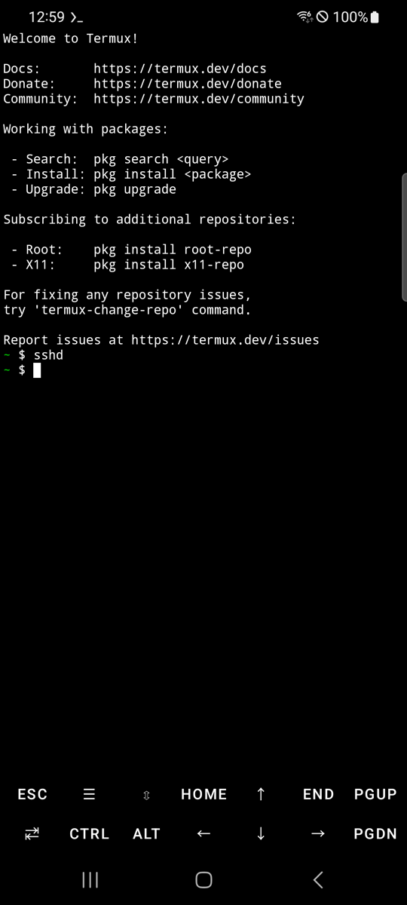

# Guía SSH con Termux

Al conectar a Termux por SSH desde tu computadora puedes escribir todos los comandos usando el teclado del ordenador.

---

## Índice

- [Requisitos previos](#requisitos-previos)
- [Paso 1 — Instalar openssh](#paso-1--instalar-openssh)
- [Paso 2 — Establecer contraseña](#paso-2--establecer-contraseña)
- [Paso 3 — Iniciar el servidor SSH](#paso-3--iniciar-el-servidor-ssh)
- [Paso 4 — Obtener la IP del teléfono](#paso-4--obtener-la-ip-del-teléfono)
- [Paso 5 — Conectar desde la computadora](#paso-5--conectar-desde-la-computadora)
- [Notas](#notas)

---

## Requisitos previos

- El teléfono y la computadora deben estar en la **misma red Wi-Fi**.

---

## Paso 1 — Instalar openssh

Abre la app **Termux** en el teléfono y ejecuta:

```bash
pkg install -y openssh
```

Espera a que termine la instalación (1-2 minutos).

---

## Paso 2 — Establecer contraseña

```bash
passwd
```

Introduce una contraseña (ejemplo: `1234`):

```
New password: 1234          ← escribir
Retype new password: 1234   ← escribir la misma contraseña
```

> Es normal que no se vea nada en pantalla mientras escribes la contraseña. Solo escríbela y pulsa Enter.

---

## Paso 3 — Iniciar el servidor SSH

> **Importante:** ejecuta `sshd` directamente en la app Termux del teléfono, no por SSH.

```bash
sshd
```

Si el prompt (`$`) regresa sin error, está funcionando.



---

## Paso 4 — Obtener la IP del teléfono

```bash
ifconfig
```

Busca la sección `wlan0`:

```
wlan0: flags=4163<UP,BROADCAST,RUNNING,MULTICAST>  mtu 1500
        inet 192.168.45.139  netmask 255.255.255.0
```

El número después de `inet` es la IP del teléfono (en este ejemplo, `192.168.45.139`).

---

## Paso 5 — Conectar desde la computadora

Abre una terminal en tu computadora (macOS: Terminal · Windows: PowerShell o Command Prompt) y ejecuta — sustituyendo la IP por la que encontraste en el paso 4:

```bash
ssh -p 8022 192.168.45.139
```

- A la pregunta `Are you sure you want to continue connecting?` → escribe `yes`.
- En `Password:` → introduce la contraseña que estableciste en el paso 2 (ejemplo: `1234`).

Una vez conectado verás el prompt `$` de Termux. Ya puedes usar todos los comandos de Termux con el teclado del ordenador.

---

## Notas

- Termux usa el puerto SSH **8022** (no el puerto estándar 22).
- Si cierras la app Termux, el servidor SSH se detiene. Para volver a conectar, abre Termux en el teléfono y ejecuta `sshd`.
